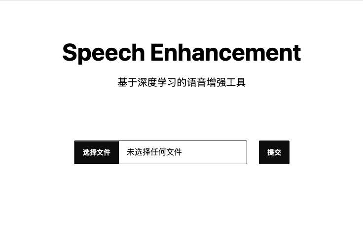

# Speech Enhancement

- 支持多种格式音频文件
- 基于 CPU 推理的语音增强模型
- 基于 EBU R128 标准对响度进行归一化处理
- 分片并行处理，提高处理效率

## 安装
### Docker
1. 拉取Docker镜像

    docker pull <镜像名称>
    
    镜像名称可以在项目的Dockerfile中查看。

2. 启动容器

    docker run -p <主机端口>:8080 -d <镜像名称>

    其中，主机端口是指用户在主机上访问该服务的端口，容器端口是指服务运行在容器内的端口。

## 使用
你可以通过浏览器访问主机的端口，即可使用该服务。

> 我们的处理链默认音频格式为采样率44100Hz,采样深度16bit的wav文件，如果你的文件不是这个格式会进行转码操作，从而会增加一定的处理时间。

> 最终完成的文件将是一个wav文件，所以文件会比原文件大很多。以mp3为例，如果原文件大小为10M，那么处理后的文件大小将会是50M左右。
## 性能
在 4 核 8 线程的 CPU 上，处理 40 分钟的音频文件，耗时在5分钟左右。

## 参考
[DeepFilterNet](https://github.com/Rikorose/DeepFilterNet)

[ffmpeg](https://ffmpeg.org/)

[ffmpeg-normalize](https://github.com/slhck/ffmpeg-normalize)

[gin](https://github.com/gin-gonic/gin)